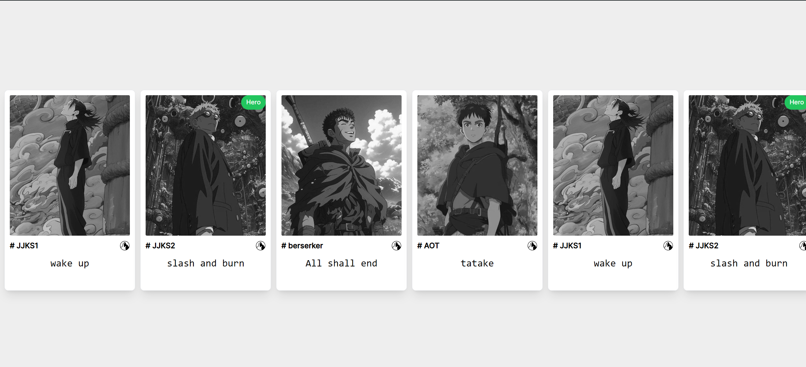

# Map Frontend Challenge
submitted by Tenzin Delek

used- React/Vite, Tailwind, React-icon

### Setup 

2. Clone the repository:
    ```bash
    git clone git@github.com:TenzDelek/MAP_Frontend_Challenge_01.git
    ```

3. Install project dependencies:
    ```bash
    cd MAP_FrontendChallenge_01
    npm install
    ```

4. Start the server:
    ```bash
    npm run dev
    ```

5. Access the app:
    - Open your web browser and navigate to `http://localhost:5173`.

## Screenshot
